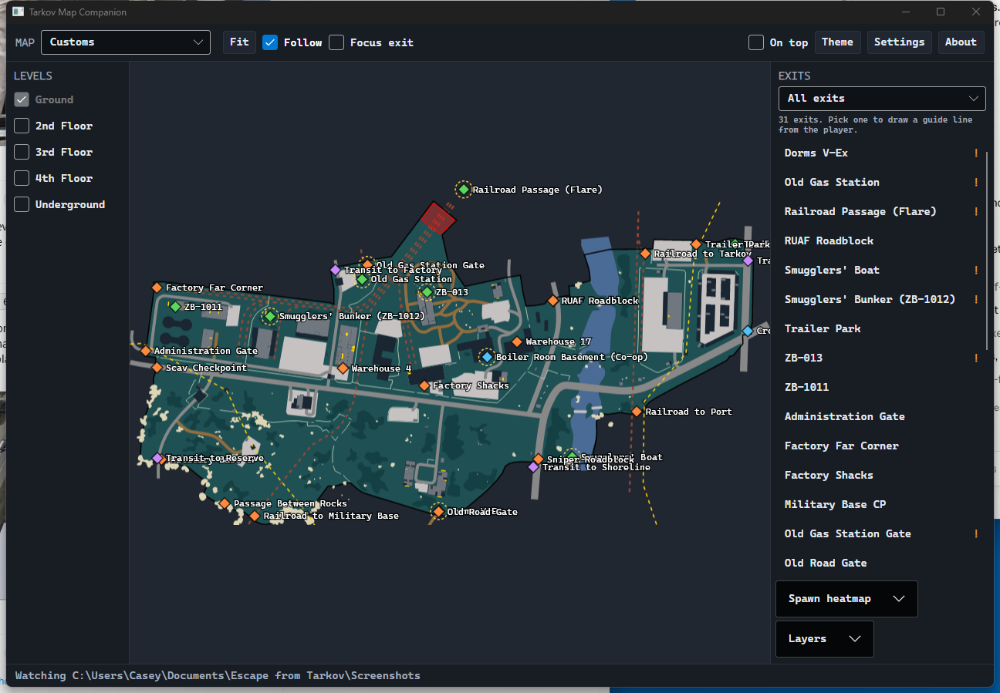

# Tarkov Map Companion

A second-monitor map for Escape from Tarkov that shows where you are, which way you are facing,
and how to get to the exit you picked.

It works by watching your screenshot folder. Tarkov writes your position and camera rotation into
the *filename* of every screenshot you take, so pressing the screenshot key updates the map.



## This is not a cheat

The app never reads the game's memory, hooks the process, injects anything, modifies a game file,
or talks to the game in any way. Its only input is a file the game itself wrote to your disk: the
*name* of a screenshot for your position, and optionally the *picture* for the exit list you
already had on screen. It cannot show you anything you did not already capture yourself, and it
cannot see other players.

## Install

Download the latest **`TarkovMapCompanion-vX.Y.Z-win-x64.exe`** from
[Releases](https://github.com/Battleroid/tarkov-map-companion/releases) and run it.

There is nothing to install. .NET is bundled, and the maps and exit data are baked into the
executable, so it works with no internet connection.

> Windows SmartScreen will warn about an unsigned executable the first time. Choose **More info**
> then **Run anyway**. Every release is built by GitHub Actions from a tag in this repo, so you can
> check the build log if you would rather see where the binary came from.

## What it does

**Position and heading.** Take a screenshot in raid and your marker moves. The trail behind you
shows where you have been this raid, and the status bar shows your coordinates, facing, the in-raid
clock, and how long the raid has been running.

**Raid-aware trail.** Tarkov's in-raid clock runs at 7x real time, so the app can tell one raid
from the next by whether the two clocks stay in step. Yesterday's route is never stitched onto
today's, and nothing older than the map's raid length is drawn.

**Exits, with their conditions.** Every exit is shown, colored by faction. Conditional exits are
ringed on the map and flagged in the list, and selecting one tells you what it needs:

- Cliff Descent — *Red Rebel ice pick · Paracord · No armor vest equipped*
- Sewer Manhole — *No backpack equipped*
- Dorms V-Ex — *5000 Roubles per player · Maximum of 4 players*
- Smugglers' Boat — *Note with code word Voron*

**Only the exits you actually have.** Tarkov offers a different subset of a map's exits every raid,
depending on where you spawned — Customs has 27, and a given raid might give you four. Tick
**Read exits from screenshot** in the exits panel, bring the extraction list up in game (double-tap
<kbd>O</kbd> by default) and take a screenshot: the app reads the list off the picture and fades
every exit the game did not offer you.

Exits are faded, never hidden, and stay clickable — the list comes from character recognition, and
a misread should cost you a dim marker, not a missing one. Anything it reads but cannot place is
named in the panel rather than quietly dropped. Readings accumulate through a raid, so a screenshot
that catches the panel part-way through opening can only add to what is already known, and the whole
lot is thrown away when the raid ends or you change map. It uses the OCR engine built into Windows,
so it adds nothing to the download, and it costs about 25 ms per screenshot.

Verified from 1024x768 to 5120x1440, across 4:3, 5:4, 16:9, 21:9 and 32:9, for both PMC and Scav
lists. Small frames are upscaled before reading, because below about 900 lines the panel's text gets
small enough that whole rows go unseen rather than misread. If a read ever goes wrong,
`--read-exits` prints every stage of it.

**Guide line and focus mode.** Pick an exit and a line is drawn to it, labeled with the distance
and how far you have to turn (`348 m, 18° right`). Turn on **Focus exit** and the view frames you
and the exit together, tightening as you close in so the screen only shows what matters. Turning it
off puts your previous view back exactly as it was.

**Route markers.** Press **Mark**, then click the map in the order you mean to visit — quest
objectives, a stash worth the detour, wherever you dropped something. Each click leaves a numbered
pin; press **Mark** again to finish. The guide line then walks the route in order and only goes
back to pointing at your exit once the route is done, so the exit can stay selected the whole time
without getting in the way. Focus mode frames the next marker rather than the exit, for the same
reason.

A pin retires once you come within 50 m of it, adjustable in **Settings**. By default it shows as
reached for one screenshot and is gone on the next: the confirmation is the point, since a pin that
simply vanishes leaves you unsure whether you got close enough or had misplaced it. The other
option removes it the moment you are inside the radius. **Clear marks** drops the whole route and
hands the line back to the exit.

**Smooth camera.** With **Follow** on, the view glides to your new position instead of jumping. A
jump costs you your bearings — you have to find yourself on the map again every screenshot —
where a move you can follow does not. It applies to focus mode's reframing too, and never to your
own panning and zooming, which stay locked to the pointer. Toggle it in **Settings**.

**Exit filter and nearest-first.** "Running as PMC" hides the Scav-only exits you cannot use — on
Customs that is 16 of 31 gone. **Nearest first** reorders the list by distance from your last known
position, and every exit shows its distance either way.

**Spawn heatmap.** Where PMCs, Scavs, AI PMCs and bosses can start. The radius is set in game
meters, so zooming changes how much you see rather than what the data says, and each band is scaled
against its own peak so a sparse group stays visible next to a dense one.

**Other layers.** Loot containers, hazards, locked doors, switches, mounted guns, BTR stops, boss
zones and transits, each independently toggleable.

**Screenshot cleanup.** Optional and **off by default**. When enabled it keeps only the newest N
screenshots, or removes each one after reading it. Deleted files go to the Recycle Bin, never
outside the watched folder, and never anything that does not match Tarkov's own screenshot naming.

**All 13 maps.** Customs, Factory, Ground Zero, Icebreaker, Interchange, The Lab, The Labyrinth,
Lighthouse, Reserve, Shoreline, Streets of Tarkov, Terminal, Woods.

**Floor switching, including the ground floor.** The map artwork stacks floors as opaque geometry,
so an underground level is hidden behind the ground floor. Turning **Ground** off is what reveals
it — Factory's Tunnels being the obvious case.

**Map detection.** Pick your map from the dropdown, or let a position that cannot be on the current
map offer you the right one. It proposes rather than switches, because several maps overlap in world
coordinates and a wrong auto-switch mid-raid is worse than no suggestion. Switching automatically is
available in **Settings** if you would rather.

**Squad positions.** Press **Host session** and the app hands you a code like `K7QM4-3FHB9-8TZR9-M4X7Q`.
Anyone who pastes it into **Join** appears on your map, and you on theirs. People can join part-way
through a raid and get everybody's current positions straight away, and you can stop and restart a
session at any point if something goes wrong.

**Shift-click to ping.** Marks a spot for the whole squad, with a pulse, your name, and a countdown.
It lasts 30 seconds and clears itself, so nothing has to be tidied up mid-raid, and it makes a noise
so a teammate notices while they are looking at the game rather than the map. Turn the sound off in
**Settings** if you would rather. Pings work solo too, as a scratch mark that expires on its own.

Teammates are only drawn when they are on the same map as you — a position from another raid means
nothing in this one's coordinates. They stay in the roster, labelled with where they actually are.
Every marker also carries its age and fades as it gets older, because peers only report when they
take a screenshot: a minute-old dot drawn at full strength reads as "he is there now", which is how
you end up trusting an angle nobody is covering.

There is no server. The code contains the host's address and a shared key, so the squad connects
directly and the traffic is encrypted with a key nobody else has. Everyone dials the host, which
means only one person needs to be reachable from outside their router — and the host does not even
have to be playing.

**If you have to forward a port**, it is one: **`TCP 24601`, inbound, to the hosting PC**. Only the
host needs it; people joining you open nothing. The party panel prints the exact port and your PC's
address on the network when the router will not do it for itself, and the same line is in
**Settings** before you ever need it. The port is configurable there if 24601 clashes with
something, and hosting refuses to start rather than quietly moving to another port — a forward
pinned to a number that has silently changed is the worst kind of broken. `--party-test` tells you
which case you are in.

> **Worth thinking about before you use it.** Position sharing keeps the app's "never touches the
> game" property, but it does change who knows what. With your own squad it is hard to object to —
> you could already say "I'm at Dorms" over voice, and this is only more precise. But the app cannot
> tell a squad from a group of strangers coordinating, because it has no view into the game's party
> system. That is a judgement call it cannot make for you.

**Light and dark, at a readable size.** Monospaced throughout, with a text-size slider, and an
always-on-top toggle for when it shares a screen with something else.

## First run

The app looks for `Escape from Tarkov\Screenshots` under Documents, and under OneDrive if OneDrive
has relocated your Documents folder, preferring whichever one actually has screenshots in it. If it
still points somewhere wrong, press **Find** in **Settings**, or **Browse** to set it by hand. The
line under the folder says how many Tarkov screenshots it can see — if that says zero after you
have taken some in raid, the game is writing somewhere else and **Find** will locate it. Pick your map from the dropdown; if a position lands somewhere the current map
cannot contain, the app offers to switch.

## Building from source

Needs the [.NET 8 SDK](https://dotnet.microsoft.com/download/dotnet/8.0).

```
git clone https://github.com/Battleroid/tarkov-map-companion
cd tarkov-map-companion
dotnet test              # 341 tests
Run.bat                  # or: dotnet run --project src/TarkovMapCompanion
```

To produce the same single-file executable the releases ship:

```
scripts\publish.ps1
```

### Extra command-line modes

| Command | What it does |
| --- | --- |
| `--render-test <map> [out.png] [w] [h] [floors] [nobase] [bare] [marks]` | Renders a map to a PNG with no window. The quickest way to check a coordinate change. `floors` is a comma-separated list, `nobase` hides the ground floor, `bare` drops the markers, `marks` lays a route of waypoints across it. |
| `--fetch-data [out]` | Rebuilds the embedded POI snapshot from tarkov.dev. |
| `--fetch-wiki [out]` | Rebuilds the embedded exit conditions from the EFT wiki. |
| `--find-screenshots` | Prints every place Tarkov screenshots might be and what is in each. What to run when the map never moves. |
| `--party-test [name] [local]` / `--party-test join <code> [name]` | Hosts or joins a position-sharing session from the console. Says whether this network can host at all, which is the one part that cannot be tested any other way. `local` uses loopback so two processes on one machine can talk. |
| `--read-exits <screenshot.png> [map] [whole]` | Reads the extraction panel out of one screenshot and prints every stage: the raw text, the rows it grouped, and which exits it matched. What to run when a read goes wrong. |

## Where the data comes from

Map artwork, geometry, exits, spawns and loot positions come from the
[tarkov.dev](https://tarkov.dev) community project — specifically
[`tarkov-dev`](https://github.com/the-hideout/tarkov-dev) for the geometry (MIT) and
`json.tarkov.dev` for the point-of-interest data. Exit *conditions* are not in that data and are
taken from the [Escape from Tarkov Wiki](https://escapefromtarkov.fandom.com) (CC BY-SA).

Map authors are credited individually in the app's About screen: **Shebuka** (10 maps),
**Tarkov.dev** (The Lab, The Labyrinth) and **TarkovBOT.eu** (Icebreaker).

Exit conditions are community-maintained and can lag a patch. You can correct them without
rebuilding by creating `%APPDATA%\TarkovMapCompanion\extract-notes.json`; entries there override
the bundled ones per exit.

## Where it stores things

| Path | Contents |
| --- | --- |
| `%APPDATA%\TarkovMapCompanion\settings.json` | Your preferences. Hand-editable. |
| `%APPDATA%\TarkovMapCompanion\extract-notes.json` | Optional overrides for exit conditions. |
| `%LOCALAPPDATA%\TarkovMapCompanion\cache\` | Downloaded maps and tiles. Safe to delete. |
| `%LOCALAPPDATA%\TarkovMapCompanion\cache\app.log` | What the app was doing, including why it stopped. Worth attaching to a bug report. |

Party activity is logged on both sides with a shared tag derived from the session secret, like
`[party ecb8932e host]`. Both ends compute the same tag without either sending it, so two people's
logs can be lined up side by side — and a tag that differs is itself the answer, because it means
somebody pasted an older code. Addresses are logged with the last octet masked, so a pasted log
does not hand out anyone's IP.

## License

Code is [MIT](LICENSE). Bundled third-party data keeps its own terms — see
[NOTICE.md](NOTICE.md).

Escape from Tarkov is a trademark of Battlestate Games. This is an unofficial fan-made tool with no
connection to Battlestate Games.
